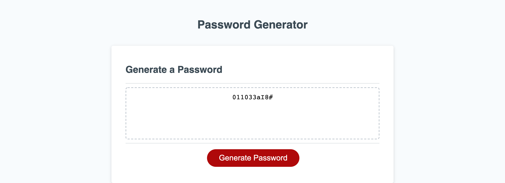

## Password Generator

The purpose of this project is to generate a random password between 8 and 128 characters long.

The user is prompted to select how many characters they would like their password to contain.

The user is then presented with a series of confirms asking the user what types of characters they would like their password to contain.

After answering the confirms, a random password is generated and written to the page.

## Screenshot

## Link to GitHub Repository

https://github.com/ssevadjian/Password-Generator

## Link to Live Page

https://ssevadjian.github.io/Password-Generator/